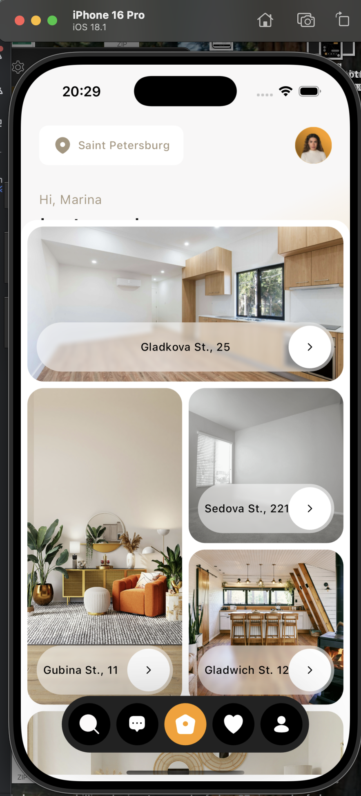

# 🏠 Real Estate Flutter App
*A beautifully animated property discovery app with interactive maps and smooth transitions.*

---

## ✨ Features
- **Ripple Animation Bottom Bar**: Tactile feedback for navigation.
- **Animated Counters**: Smooth number transitions (e.g., "1,056 Offers").
- **Blurred Card Effects**: Elegant property cards with dynamic blur and fade.
- **Interactive Map**: Search and explore locations with seamless transitions.

---

## 🎥 Showcase


---

## 🛠 Key Components

### 1. **Animated Bottom Bar Icons**
Uses `RoundOptionWidget` with ripple and scale animations:
```dart
RoundOptionWidget(
  iconUrl: "assets/home.svg",
  iconUrlActive: "assets/home_active.svg",
  isActive: true,
  onTap: () => print("Navigation tapped"),
  backgroundColor: Colors.blue,
)
```


---

### 2. **Dynamic Counter Widget**
Animated numbers (e.g., "1,056 Offers"):
```dart
AnimatedCounterWidget(
  start: 0,
  end: 1056,
  duration: Duration(seconds: 2),
  textColor: Colors.black,
)
```

---

### 3. **Property Cards with Blur Effects**
`PlaceWidget` combines blur, fade, and scale:
```dart
PlaceWidget(
  image: "assets/property1.jpg",
  title: "Gladkova St., 25",
  isFullView: false,
)
```


---

## 🚀 Setup

### Prerequisites
1. **FVM (Flutter Version Manager)**  
   Manages Flutter SDK versions (required for version 3.24.5):
   ```bash
   dart pub global activate fvm  # Install FVM
   fvm install 3.24.5           # Install Flutter 3.24.5
   fvm use 3.24.5               # Set as default
   ```  

2. **Ruby & CocoaPods (for iOS)**
   ```bash
   brew install ruby            # Install Ruby
   # For Intel Macs:
   echo 'export PATH="/usr/local/opt/ruby/bin:$PATH"' >> ~/.zshrc
   # For Apple Silicon (M1/M2):
   echo 'export PATH="/opt/homebrew/opt/ruby/bin:$PATH"' >> ~/.zshrc
   source ~/.zshrc             # Reload shell
   gem install cocoapods        # Install CocoaPods
   pod setup                   # Initialize CocoaPods
   ```  

### Run the App
```bash
fvm flutter pub get  # Install dependencies
fvm flutter run      # Launch the app
```  

---

## 🌟 Why This Stands Out
- **Fluid Animations**: Leverages `flutter_animate` and custom painters.
- **Performance**: Optimized with `AnimationController` disposals.
- **Modular**: Reusable components like `AnimatedCounterWidget`.

---